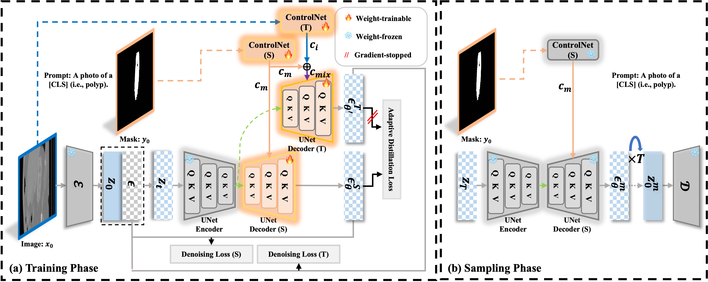
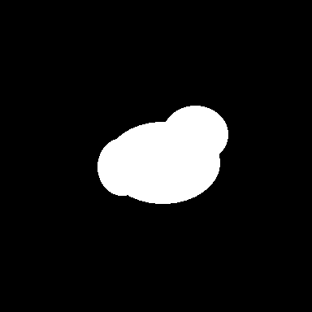
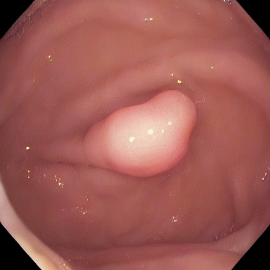
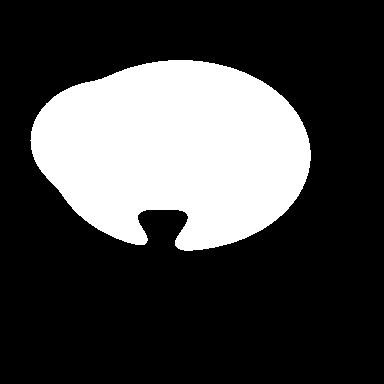
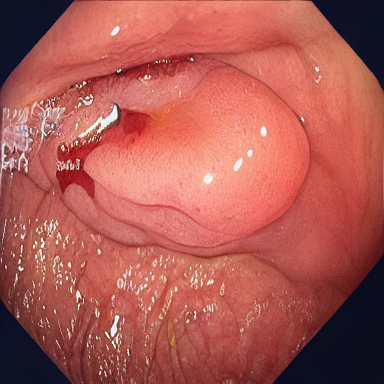

<div align="center">
<h1>Adaptively Distilled ControlNet: Accelerated Training and Superior Sampling for Medical Image Synthesis</h1>

[](https://arxiv.org/pdf/2507.23652)


</div>

<div align="center">

</div>

### 🚀 **Superiority Demonstration**

#### Fast Convergence


Compared with [Siamese-Diffusion](https://github.com/Qiukunpeng/Siamese-Diffusion), the proposed approach slightly increases training memory usage due to the joint training of a teacher model, which provides stronger prior guidance for the student model, ultimately accelerating its convergence.  

Even without using the plug-and-play `Online-Augmentation` module from [Siamese-Diffusion](https://github.com/Qiukunpeng/Siamese-Diffusion), our method achieves competitive performance on [Polyp-PVT](https://github.com/DengPingFan/Polyp-PVT).

### 🖼️ Visualization Results

#### Kidney Tumor Visualization (CT)


#### Polyp Visualization (RGB)


---

## 🔧 Fork: Liver Surgery Adaptation (juliensauter/ADC)

This fork adds MPS (Apple Silicon) compatibility, liver surgery adaptation scripts,
and a one-command setup for colleagues. All upstream functionality is preserved.

### Quick Start
```bash
# Clone with submodule
git clone --recurse-submodules <livervision-repo-url>
cd livervision/Research_Projects/ADC

# One-command setup: installs deps, downloads weights (~17 GB), creates training checkpoint
uv run python setup_adc.py

# Run inference demo
uv run python tutorial_inference_local.py

# Train on your data
uv run python prepare_liver_data.py --src /path/to/your/data --out ./data
uv run python tutorial_train_single_gpu.py
```

### File Map

| File | Category | Description |
|------|----------|-------------|
| **`setup_adc.py`** | 🚀 Setup | One-command project setup (deps + weights + checkpoint) |
| **`tutorial_inference_local.py`** | 🎨 Inference | MPS/CPU/CUDA inference (replaces `tutorial_inference.py`) |
| **`tutorial_train_single_gpu.py`** | 🏋️ Training | 1-line hardware switch: `"mps"` / `"dgx_single"` / `"dgx_multi"` |
| **`prepare_liver_data.py`** | 📦 Data | Converts raw images+masks into ADC format, splits train/val |
| **`evaluate_adc.py`** | 📊 Evaluation | FID, SSIM, LPIPS metrics between real and generated images |
| **`segmentation_integration.py`** | 🧩 Integration | Joint ADC + segmentation model training (Strategy A: differentiable, Strategy B: 2-stage) |
| `create_control_ckpt.py` | 🔧 Utility | Creates `control_sd15.ckpt` from SD v1.5 (called by `setup_adc.py`) |
| `download_weights.py` | 🔧 Utility | Downloads SD v1.5 + ADC weights from HuggingFace |
| `create_sample_data.py` | 🧪 Demo | Creates synthetic polyp mask for testing |
| `create_liver_sample.py` | 🧪 Demo | Creates synthetic liver mask for testing |
| `slurm/slurm_setup.sh` | ☁️ Cluster | One-time env + weight download on SLURM |
| `slurm/slurm_train.sh` | ☁️ Cluster | Training job — auto-patches TRAINING_TARGET |
| `slurm/slurm_inference.sh` | ☁️ Cluster | Inference job — configurable via env vars |

**Upstream files** (original ADC repo): `config.py`, `share.py`, `tutorial_dataset*.py`, `tutorial_inference.py`, `tutorial_train.py`, `tool_*.py`, `cldm/`, `ldm/`, `models/`

### Upstream Fixes Applied
- `openaimodel.py`: Missing `import copy` (bug)
- `modules.py`: Dynamic CLIP device (MPS/CPU/CUDA)
- `ddim.py`: Float32 cast + dynamic device for MPS
- `model.py`: `weights_only=False` for PyTorch ≥2.6
- `util.py`: Font fallback when `DejaVuSans.ttf` missing
- `tutorial_dataset.py`: Configurable data path

### Hardware Switch
Change one line in `tutorial_train_single_gpu.py`:
```python
TRAINING_TARGET = "mps"          # Apple Silicon (local testing)
TRAINING_TARGET = "dgx_single"   # Single A100 GPU
TRAINING_TARGET = "dgx_multi"    # Multi-GPU (uses all visible GPUs)
```

### SLURM Cluster (LRZ DGX H100)
Job scripts for the university's SLURM cluster are included:
```bash
# SSH to submit node (must be on uni network / VPN)
ssh username@10.215.44.154

# Clone repo to NFS home
cd /mnt/home/$USER
git clone --recurse-submodules <livervision-repo-url>
cd ADC   # or livervision/Research_Projects/ADC

# One-time setup (installs deps, downloads ~17 GB weights) — runs as a SLURM job
mkdir -p logs
sbatch slurm/slurm_setup.sh

# Train (1 GPU default, override with --gres=gpu:2 for multi-GPU)
sbatch slurm/slurm_train.sh

# Inference (single GPU, fast)
sbatch slurm/slurm_inference.sh

# Check job status
squeue -u $USER

# View logs
tail -f logs/adc_train_<jobid>.out
```

| Script | Purpose |
|--------|---------|
| `slurm/slurm_setup.sh` | One-time env + weight download (submits `setup_adc.py` as job) |
| `slurm/slurm_train.sh` | Training job — auto-patches `TRAINING_TARGET` for single/multi GPU |
| `slurm/slurm_inference.sh` | Inference job — configurable via env vars (`CKPT`, `DDIM_STEPS`) |

**Cluster details:** `dgx_01` partition — 8× NVIDIA H100, 224 CPUs, 2 TB RAM. QoS typically limits to 4 GPUs, 2 concurrent jobs. Shared NFS at `/mnt/home/`, ephemeral scratch at `/scratch/`.

### Example Outputs
Pre-generated examples (10 DDIM steps, ADC polyp weights, MPS) in `examples/`:

| Mask | Generated |
|------|-----------|
|  |  |
|  |  |

> The liver output resembles a polyp because the model is trained on polyp data only.
> After fine-tuning on liver surgery data, liver-conditioned outputs will look realistic.

---

### 📥 Download
We provide the model weights and synthesized datasets (Polyps) on **Hugging Face**.

| Resource | Description | Link |
| :--- | :--- | :--- |
| **Model Weights** | Checkpoints for ADC (Polyps) | [🤗 Hugging Face](https://huggingface.co/SylarQ/ADC) |
| **Datasets** | Synthesized Polyps Images | [🤗 Hugging Face](https://huggingface.co/datasets/SylarQ/ADC) |

### 🛠️ Requirements
The usual installation steps involve the following commands, they should set up the correct CUDA version and all the python packages:
```bash
conda create -n ADC python=3.10
conda activate  ADC
conda install pytorch==2.4.0 torchvision==0.19.0  pytorch-cuda=11.8 -c pytorch -c nvidia
pip install -U xformers --index-url https://download.pytorch.org/whl/cu118
pip install deepspeed
```

### 🗂️ Data and Structure
We evaluated our method on three public datasets: [Polyps](https://github.com/DengPingFan/PraNet) (as provided by the PraNet project), and [Kidney Tumor](https://github.com/neheller/kits19/).
```bash
--data
  --images
  --masks
  --prompt.json
```

### 🏋️‍♂️ Training

💡 **Note:** The core contribution code has been integrated into `cldm.py`. Corresponding improvements to the model architecture should be made in `ldm/modules/diffusionmodules/openaimodel.py`, and the configuration must be updated in `models/cldm_v15.yaml`.  

A new initialization scheme has been implemented in `tool_add_control.py` to accommodate changes in the model architecture and generate `control_sd15.ckpt`.

Inspired by [Siamese-Diffusion](https://github.com/Qiukunpeng/Siamese-Diffusion), the **DHI** module is integrated as a default component.

Here are example commands for training:
```bash
# Initialize ControlNet with the pretrained UNet encoder weights from Stable Diffusion,  
# then merge them with Stable Diffusion weights and save as: control_sd15.ckpt  
python tool_add_control.py

# For multi-GPU setups, ZeRO-2 can be used to train Siamese-Diffusion  
# to reduce memory consumption.  
python tutorial_train.py
```

### 🎨 Sampling
Here are example commands for sampling:
```bash
# ZeRO-2 distributed weights are saved under the folder:  
# lightning_logs/version_#/checkpoints/epoch/  
# Run the following commands to merge the weights:  
python zero_to_fp32.py . pytorch_model.bin  
python tool_merge_control.py

# Sampling
python tutorial_inference.py
```

### 📣 Acknowledgements
This repository is developed based on [ControlNet](https://github.com/lllyasviel/ControlNet) and [Siamese-Diffusion](https://github.com/Qiukunpeng/Siamese-Diffusion). It further integrates several state-of-the-art segmentation models, including [nnUNet](https://github.com/MIC-DKFZ/nnUNet), [SANet](https://github.com/weijun-arc/SANet), and [Polyp-PVT](https://github.com/DengPingFan/Polyp-PVT).

### 📖 Citation
If you find our work useful in your research or if you use parts of this code, please consider citing our paper:
```bash
@article{qiu2025adaptively,
  title={Adaptively Distilled ControlNet: Accelerated Training and Superior Sampling for Medical Image Synthesis},
  author={Qiu, Kunpeng and Zhou, Zhiying and Guo, Yongxin},
  journal={arXiv preprint arXiv:2507.23652},
  year={2025}
}

@article{qiu2025noise,
  title={Noise-Consistent Siamese-Diffusion for Medical Image Synthesis and Segmentation},
  author={Qiu, Kunpeng and Gao, Zhiqiang and Zhou, Zhiying and Sun, Mingjie and Guo, Yongxin},
  journal={arXiv preprint arXiv:2505.06068},
  year={2025}
}
```

